# Single-Cell RNA-seq Analysis of COVID-19 PBMCs 

This repository contains the first part of an end-to-end single-cell RNA sequencing (scRNA-seq) pipeline applied to PBMC samples from COVID-19 patients.

The dataset includes four clinical groups:

- Healthy
- Mild
- Severe
- Critical

---

# Dataset Overview

**Dataset:** GSE293707 (NCBI GEO)  
**Tissue:** PBMC (Peripheral Blood Mononuclear Cells)  
**Raw size:** 72,809 cells × 36,602 genes  
**Samples (pooled):**

- GSM8888963 → Healthy
- GSM8888964 → Mild
- GSM8888965 → Severe
- GSM8888966 → Critical

Important note:  
Each severity corresponds to only **one pooled sample**, which limits biological replication and requires careful interpretation in downstream steps.

---

# Phase 1 — Quality Control (QC) and Filtering

The first step was to assess and remove low-quality cells.

For each cell, we computed:

- `n_genes`: number of detected genes  
- `n_counts`: total UMI counts  
- `mito_percent`: percent of mitochondrial gene expression  

Mitochondrial reads are commonly used as a quality indicator because dying or stressed cells tend to show abnormally high mitochondrial expression.

---

## Figure 1 — Relationship between n_counts and n_genes (colored by mito%)

  

### Interpretation

This scatter plot helps visualize the structure of the dataset and the QC thresholds:

- Most cells follow the expected curve: higher `n_counts` → higher `n_genes`
- A small cluster appears at low gene counts and low UMI counts
- These low-quality cells show higher mitochondrial percentage (bright colors)

This is a typical sign of stressed or dying cells, which should be removed.

---

## Filtering thresholds

Based on the QC patterns, the following filters were applied:

- 300 < `n_genes` < 4000  
- 800 < `n_counts` < 30,000  
- `mito_percent` < 15%

After filtering:

- 63,736 cells remained  
- Genes detected in fewer than 3 cells were removed  
- Final matrix: 63,736 cells × 25,057 genes  

This filtering step is important because low-quality cells can distort downstream PCA and create artificial clusters.

---

# Phase 2 — Normalization and Feature Selection

After QC filtering, normalization was applied to remove technical effects such as sequencing depth.

Steps included:

1. Total-count normalization (`target_sum = 1e4`)
2. Log transformation
3. Scaling (mean = 0, variance = 1)

---

## Highly Variable Genes (HVGs)

Highly Variable Genes (HVGs) were selected using the **Seurat v3 method**, with:

- batch key = `gsm_id`
- top HVGs = 3,000 genes

This is an important detail because it ensures the selected HVGs represent biological variation rather than sample-specific technical artifacts.

---

# Phase 3 — PCA (Dimensionality Reduction)

Principal Component Analysis (PCA) was applied using the top 3,000 HVGs.

The goal of PCA is to reduce the dataset from thousands of genes into a smaller number of components that capture most of the variation.

---

## Figure 2 — PCA Variance Ratio (log-scale)

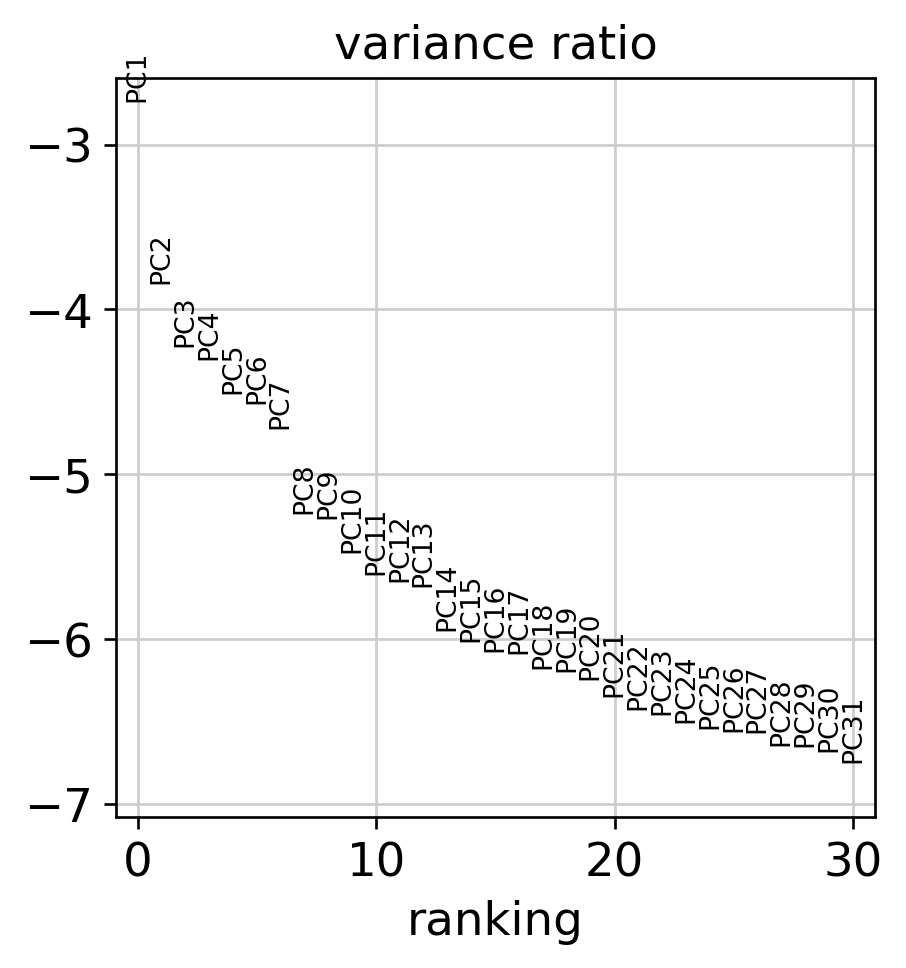

### Interpretation

This plot shows:

- A sharp drop in variance explained after the first few PCs
- PC1 captures the largest amount of variation
- The curve begins flattening after ~15 PCs

This suggests most meaningful structure is captured early.

---

## Figure 3 — PCA Variance Ratio (linear-scale)

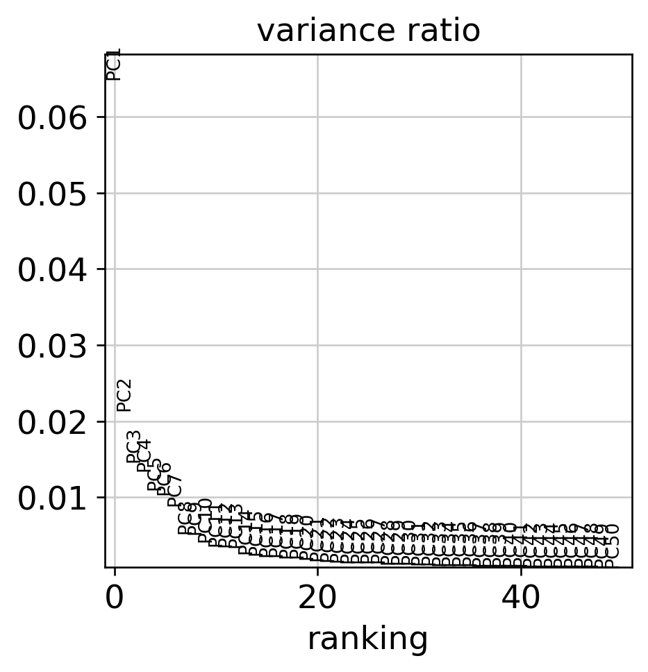

### Interpretation

This plot confirms the same idea more clearly:

- The first ~10 PCs explain most of the signal
- After ~15–20 PCs, additional PCs contribute only small gains

Based on both plots, **20 PCs** were selected for downstream analysis.

---

# Phase 4 — PCA Visualization and Global Data Structure

After PCA, we visualized the data in 2D using PC1 and PC2 to understand global structure and how severity groups relate to each other.

---

## Figure 4 — PCA colored by clinical severity

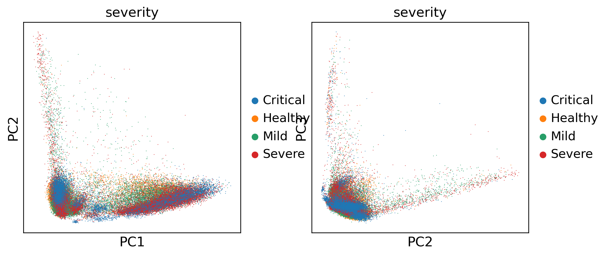

### Interpretation

Several important observations can be made:

- The PBMC dataset shows the typical "L-shaped" structure in PCA space
- Severity groups strongly overlap, meaning there is no trivial separation
- However, a gradual shift can be observed from Healthy to more severe groups

This suggests that severity effects exist, but are subtle and mixed with cell-type-driven variation.

---

## Figure 5 — PCA colored by GSM sample ID

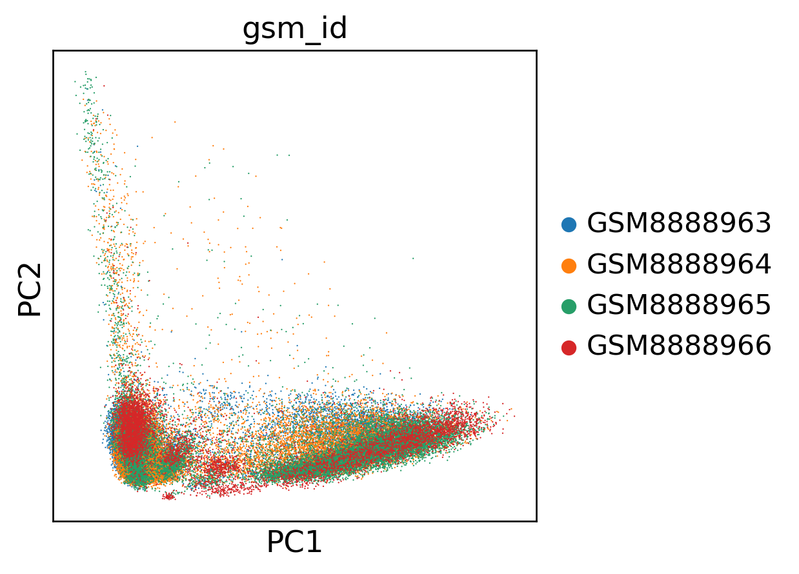

### Interpretation

This plot highlights a key experimental limitation:

- Each severity corresponds to exactly one pooled sample
- Some structure may reflect sample-specific or donor-specific variation

This is important because it means later machine learning models may accidentally learn sample identity rather than disease biology if validation is not designed carefully.

---

## Figure 6 — PCA colored by binary condition (Healthy vs Disease)

### Interpretation

- Healthy and Disease cells overlap heavily
- This confirms that disease signal is not cleanly separable in an unsupervised embedding
- More detailed downstream analysis (clustering, cell-type annotation, supervised learning) is required to detect severity-related transcriptional patterns

---

By the end of Phase 4:

- Low-quality cells were removed using QC filtering
- Data was normalized and scaled
- HVGs were selected in a batch-aware manner
- PCA captured the main structure of PBMC variation
- Severity effects were visible only as subtle shifts, not as clean clusters

This sets the foundation for the next stage of the pipeline: clustering and cell-type identification.

---

# Phase 5 — Clustering and Cluster-Level Exploration

After PCA, the next step was to group cells into biologically meaningful clusters.

To do this, we constructed a k-nearest-neighbor graph in PCA space and applied **Leiden clustering**.

Leiden clustering is commonly used in scRNA-seq because it:

- Works well on large graphs
- Detects communities (cell populations)
- Produces stable clusters compared to older algorithms

---

## 5.1 Testing different Leiden resolutions

Leiden clustering depends strongly on the **resolution parameter**.

- Low resolution → fewer clusters (broad populations)
- High resolution → more clusters (finer subtypes)

---

## Figure 7 — Leiden clustering across multiple resolutions

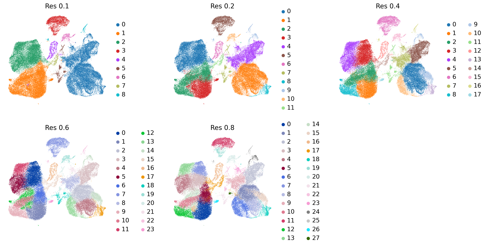

### Interpretation

This figure shows clustering results for:

- Resolution 0.1
- Resolution 0.2
- Resolution 0.4
- Resolution 0.6
- Resolution 0.8

Key observations:

- At **0.1**, only a few large clusters exist (too coarse).
- At **0.8**, many clusters appear (likely over-splitting).
- **0.4** provides a good balance:
  - major PBMC populations are separated
  - clusters remain large enough for downstream analysis
  - biological structure stays clean and interpretable

Based on this comparison, **resolution = 0.4** was selected as the final clustering resolution.

---

## 5.2 Final clustering (resolution = 0.4)

---

## Figure 8 — Final Leiden clustering (res = 0.4)

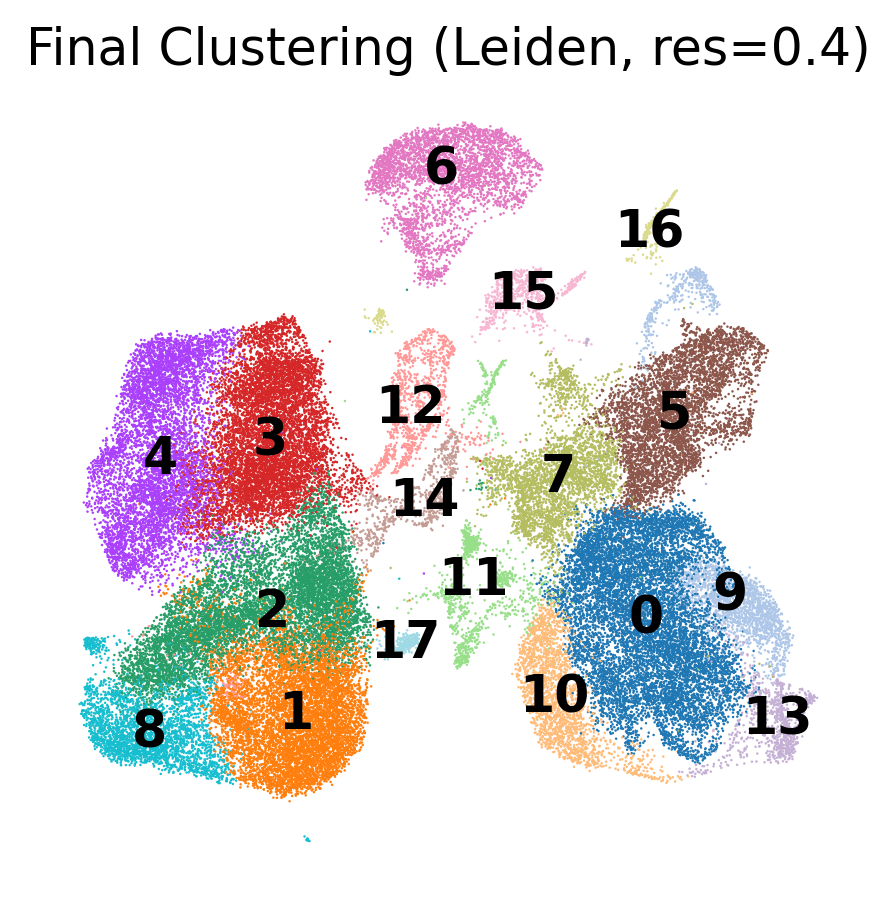

### Interpretation

This plot shows the final Leiden clustering result:

- 18 clusters were detected (0–17)
- The clusters form clear groups in embedding space
- Several clusters are large (major immune populations)
- Several clusters are small (rare populations)

This cluster structure forms the foundation for:

- cell-type annotation
- cluster composition analysis
- downstream machine learning (cell-type specific modeling)

---

## 5.3 Cluster composition by condition (Healthy vs Disease)

To understand whether disease changes immune composition, we calculated for each cluster:

- fraction of cells coming from Disease
- fraction of cells coming from Healthy

---

## Figure 9 — Cluster composition by condition

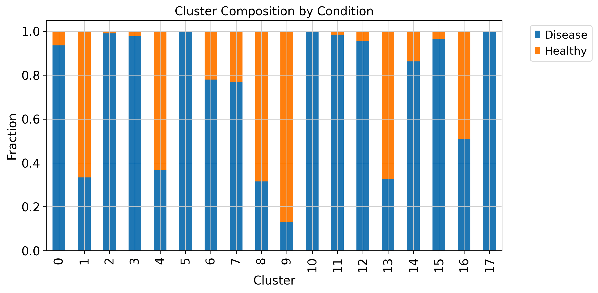

### Interpretation

This stacked bar plot shows:

- Each bar is one Leiden cluster
- Blue = Disease
- Orange = Healthy

Important patterns:

- Some clusters are almost entirely Disease (blue-dominant)
- Some clusters are enriched for Healthy cells
- Many clusters contain a mixture

This suggests that COVID-19 affects immune composition, but not uniformly across all cell populations.

It also supports the idea that severity-related transcriptional changes may be **cell-type specific**, not global.

---

# Phase 6 — Marker Genes and Cell-Type Annotation

After clustering, we performed cluster annotation using marker genes.

This is one of the most important steps in scRNA-seq analysis, because:

- clusters alone are not meaningful without biological labels
- marker genes allow us to identify known immune cell types

Marker gene analysis was performed in two complementary ways:

1. **Ranked marker genes per cluster**  
2. **Dot plot of canonical immune markers across clusters**

---

## 6.1 Ranked marker genes per cluster

For each cluster, we identified genes that are highly expressed compared to the rest of the dataset.

---

## Figure 10 — Top marker genes for each cluster (cluster vs rest)

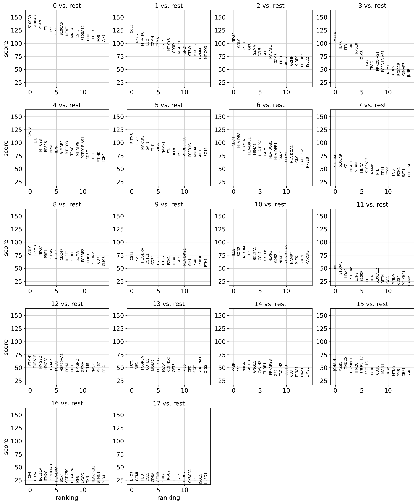

### Interpretation

Each panel shows:

- one cluster compared against all other cells
- top genes ranked by differential expression score

This figure provides the first biological clues for annotation.

Examples of recognizable marker patterns:

- **Monocyte markers:** LST1, S100A8, S100A9, FCN1, LGALS3  
- **T cell markers:** TRAC, IL7R, LTB  
- **Cytotoxic/NK markers:** NKG7, GNLY, GZMB  
- **B cell markers:** MS4A1, CD79A  
- **Plasma markers:** MZB1, JCHAIN  
- **Megakaryocyte markers:** PPBP  

This ranking is especially useful for identifying rare clusters.

---

## 6.2 Dot plot of canonical marker genes across clusters

To confirm cluster identity more clearly, we used a dot plot.

Dot plots summarize two key properties:

- **Dot size:** fraction of cells expressing the gene  
- **Dot color:** average expression level  

---

## Figure 11 — Dot plot of marker genes across clusters

### Interpretation

This figure makes annotation more robust, because:

- it confirms marker expression patterns across all clusters
- it allows detection of mixed clusters
- it helps validate whether clusters correspond to known PBMC populations

For example:

- clusters with high TRAC/IL7R are likely CD4+ T cells  
- clusters with high NKG7/GNLY are NK or cytotoxic T cells  
- clusters with high MS4A1/CD79A are B cells  
- clusters with high LST1/S100A8/LYZ are monocytes  

---

## 6.3 Cluster similarity using heatmap

To check whether clusters are transcriptionally similar, we generated a heatmap based on gene expression.

---

## Figure 12 — Cluster heatmap (global expression patterns)

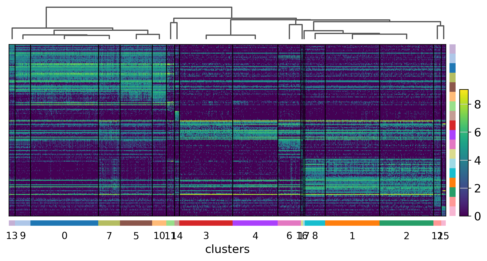

### Interpretation

This heatmap shows:

- rows: genes
- columns: clusters (ordered by hierarchical clustering)
- similar clusters appear closer together

This confirms:

- clusters form groups (for example, lymphoid vs myeloid)
- small clusters often attach to larger immune families
- the clustering is biologically coherent

---

## 6.4 Cluster similarity using a second marker visualization

We also generated an additional marker-based cluster overview.

---

## Figure 13 — Marker expression overview (violin/dot-style across clusters)

### Interpretation

This visualization reinforces:

- which clusters share immune marker signatures
- which clusters represent rare populations
- which clusters are likely subtypes rather than major populations

It also serves as a second confirmation step before assigning final cell-type labels.

---

By the end of Phase 6:

- Leiden clustering was applied and optimized across resolutions
- Resolution 0.4 was selected as the best trade-off
- 18 clusters were detected
- Cluster composition was analyzed (Healthy vs Disease)
- Marker genes were computed per cluster
- Canonical markers were visualized using dot plots and heatmaps
- Clusters were prepared for final cell-type labeling

These steps provide the biological foundation needed for the next phases:
- cell-type level differential expression
- machine learning modeling per cell type
- severity prediction and generalization testing

---

# Phase 7 — Feature Engineering and Machine Learning Preparation

After clustering and marker-based annotation, the next step was to prepare the dataset for supervised machine learning.

The main goal of this phase was:

Predict whether a cell belongs to **Healthy** or **Disease**  
based on its gene expression profile.

However, scRNA-seq data introduces several challenges that make ML non-trivial:

- Extremely high dimensionality (thousands of genes)
- Strong cell-type effects (cell identity dominates variation)
- Batch/sample structure (each severity = one pooled sample)
- High risk of **data leakage** if preprocessing is done incorrectly

Because of these issues, Phase 7 focuses on building a careful, structured ML-ready dataset.

---

## 7.1 Defining the ML target labels

Two label formats were created:

### 1) Binary classification
- **Healthy**
- **Disease** (Mild + Severe + Critical)

This binary setup was used for most of the models because it is:

- statistically more stable
- less sensitive to class imbalance
- easier to evaluate under LOSO cross-validation

---

### 2) Severity-based grouping (optional downstream)
Although the final models were mainly trained in binary mode,
the dataset still contains severity metadata:

- Healthy
- Mild
- Severe
- Critical

This makes it possible to later evaluate whether models generalize across severities.

---

## 7.2 Dimensionality reduction is not enough for ML

Although PCA and UMAP reduce dimensionality, they are **not used as ML features** here.

Why?

Because PCA/UMAP embeddings are:

- optimized for visualization
- sensitive to batch structure
- not stable across different splits
- not biologically interpretable

Instead, the models were trained directly on gene-level features.

---

## 7.3 Selecting informative genes (Feature Selection)

Training models on all ~25,000 genes is not efficient and can lead to:

- heavy overfitting
- unstable models
- poor generalization
- extremely slow training

So we performed feature selection.

The main approach used was:

### Differential Expression (DEG-based selection)

For each cell type / cluster group, genes were ranked by:

- differential expression between Healthy and Disease

Then the top genes were selected as model input features.

This is a biologically meaningful approach because:

- it prioritizes genes that change under disease
- it reduces noise
- it produces interpretable features

---

## 7.4 Avoiding data leakage (critical step)

In scRNA-seq ML pipelines, the most common mistake is:

performing DEG selection using the full dataset  
and then evaluating on a held-out fold

This leaks information because the test fold influences the selected genes.

To avoid this, the pipeline was designed so that:

- DEG selection happens only on the training split
- the selected gene list is then applied to the validation/test split

This is essential to produce realistic AUC values.

---

## 7.5 Cross-validation strategy (LOSO)

A major limitation of the dataset is that:

- each severity group corresponds to a single pooled sample (one GSM)

This means random train/test splits would strongly overestimate performance.

So instead, the project used:

### Leave-One-Sample-Out (LOSO) cross-validation

In LOSO:

- one GSM sample is completely held out as test
- the model is trained on the remaining samples
- this is repeated for all samples

This is the most appropriate evaluation strategy for this dataset, because it:

- tests generalization across biological samples
- reduces sample-identity learning
- simulates real-world deployment more realistically

---

## 7.6 Models prepared for training

After feature selection and dataset structuring, multiple models were trained:

### Classical models
- LDA
- Logistic Regression
- Linear SVM

### Neural models (explored later)
- MLP
- Advanced NN (ResMLP-style)
- TabNet

---

## 7.7 Why Phase 7 matters

Phase 7 is the bridge between:

**single-cell analysis**
and  
**machine learning**

This phase ensures that:

- ML results are not artificially inflated
- the gene features are biologically meaningful
- the evaluation is sample-aware and realistic

This sets the foundation for the next phases, where multiple models are trained, tuned, and compared.

---

---

# 🤖 Phase 8 — Neural Network Models (MLP + Advanced NN)

After preparing the ML-ready dataset in Phase 7, we trained neural network models to predict **Disease vs Healthy** using the selected gene features.  
This phase focuses on training behavior, convergence, and evaluation using ROC curves.

---

## 8.1 Baseline Model: MLP (Multi-Layer Perceptron)

The first deep learning model tested was a standard **MLP**.  
This model acts as a baseline neural network classifier.

### Figure 1 — MLP Training Curve

From the training curve:

- The training loss decreases rapidly in the first epochs.
- Validation loss follows the same pattern.
- Both curves stabilize smoothly.
- No strong divergence is observed.

This indicates:

stable convergence  
no major overfitting  
the engineered features contain strong predictive signal

---

### Figure 2 — ROC Curve (MLP)

The ROC curve is close to the top-left corner, meaning:

- very low false positive rate
- very high true positive rate

The MLP achieves a near-perfect AUC, showing that the dataset is highly separable.

---

## 8.2 Advanced Neural Network (Residual MLP)

To explore whether a more powerful architecture improves performance, we implemented an **advanced neural network**, inspired by residual MLP designs.

This architecture includes:

- deeper layers
- dropout regularization
- normalization
- residual connections

---

### Figure 3 — Advanced NN Training Loss
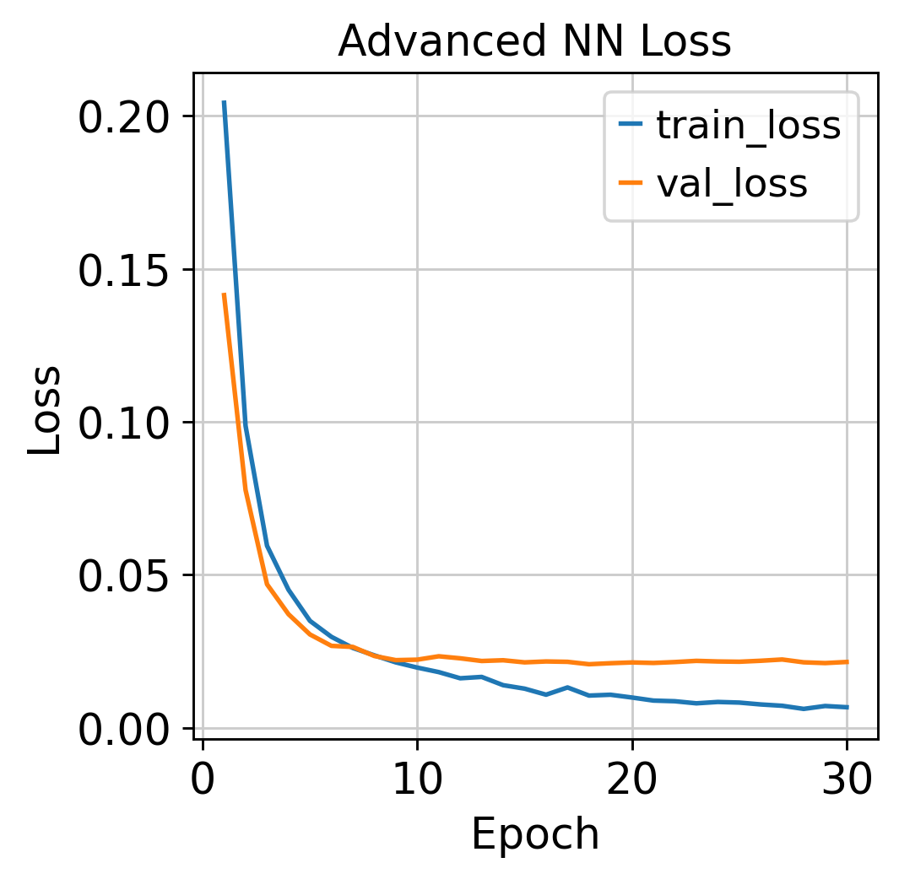

This figure shows:

- rapid drop in training loss
- validation loss stabilizing early (around epoch 10)
- small generalization gap

This suggests:

- strong feature signal
- faster convergence compared to standard MLP
- stable generalization

---

### Figure 4 — Validation Metrics (AUC & Accuracy)
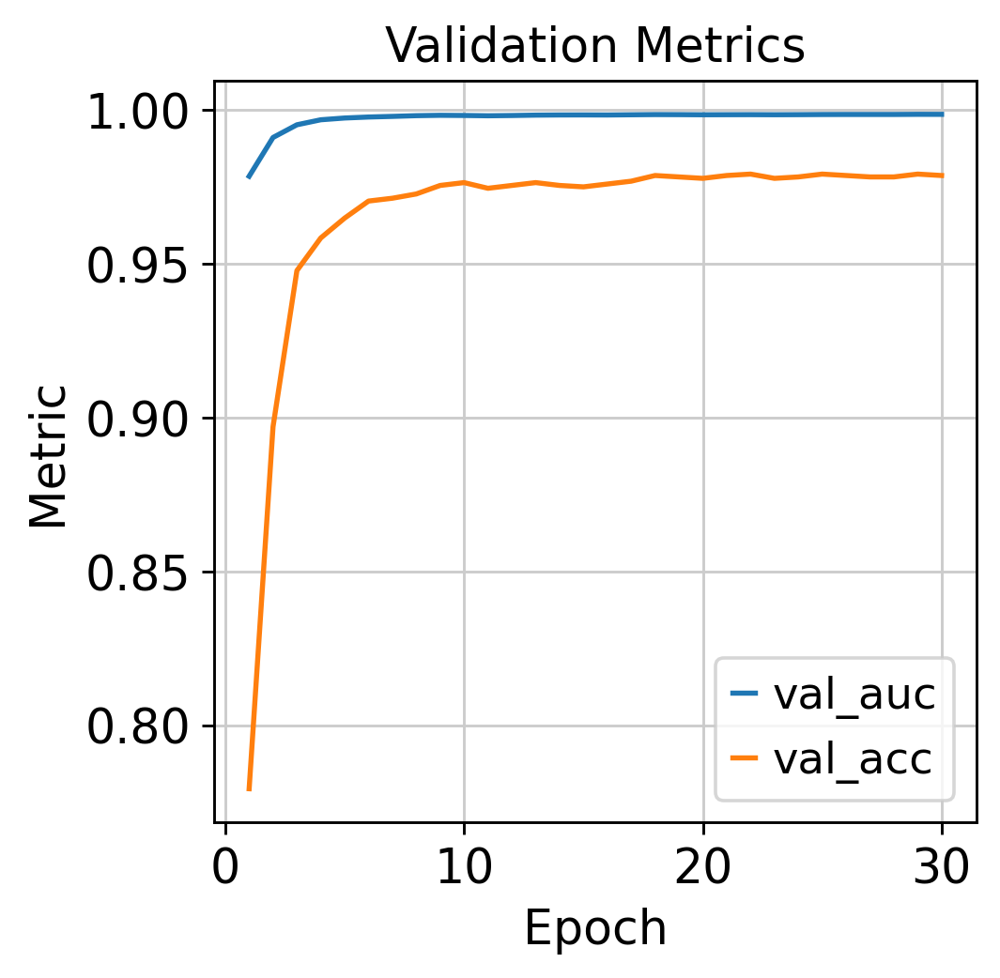

This plot tracks:

- validation AUC
- validation accuracy

The results show:

- AUC reaches ~1.0 very quickly
- accuracy stabilizes near ~0.97–0.98

This indicates the model learns the Healthy vs Disease boundary very efficiently.

---

### Figure 5 — ROC Curve (Advanced NN)
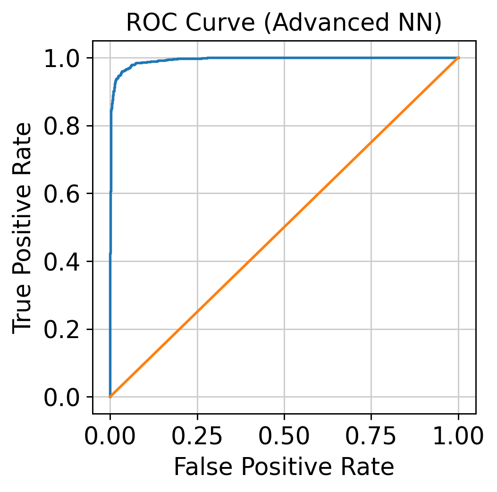

The advanced model also achieves near-perfect AUC, similar to MLP.  
This suggests that the engineered features are already highly informative and linearly separable, so deep nonlinear capacity adds only a small improvement.

---

# Phase 9 — TabNet Model (Attention-Based Learning)

In Phase 9, we trained **TabNet**, a deep learning model designed specifically for tabular data.

TabNet is useful because it:

- learns attention masks
- selects features dynamically
- improves interpretability of feature importance

---

### Figure 6 — TabNet Training History

This figure shows:

- training loss decreasing steadily
- validation AUC increasing rapidly
- AUC reaching near 1.0 early

TabNet converges quickly and performs extremely well on this dataset.

---

### Figure 7 — ROC Curve (TabNet)
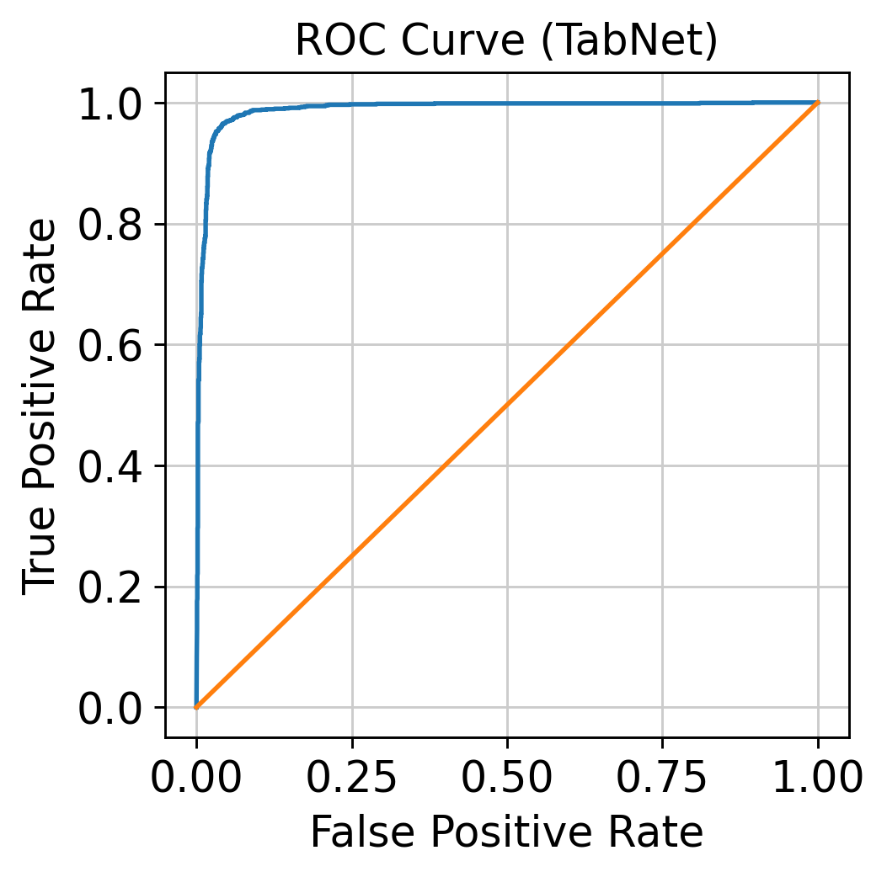

The ROC curve again demonstrates excellent performance.

However, TabNet tends to show slightly more variability across folds compared to simpler linear models, which becomes clearer in Phase 10.

---

# Phase 10 — Model Comparison & Stratified Performance Analysis

In this phase, we compared all models trained so far:

- LDA
- Logistic Regression
- Linear SVM
- MLP
- Advanced NN (Residual MLP)
- TabNet

Evaluation is performed using AUC as the main metric.

---

## 10.1 Overall Model Performance (AUC)

### Figure 8 — Model Comparison (AUC)
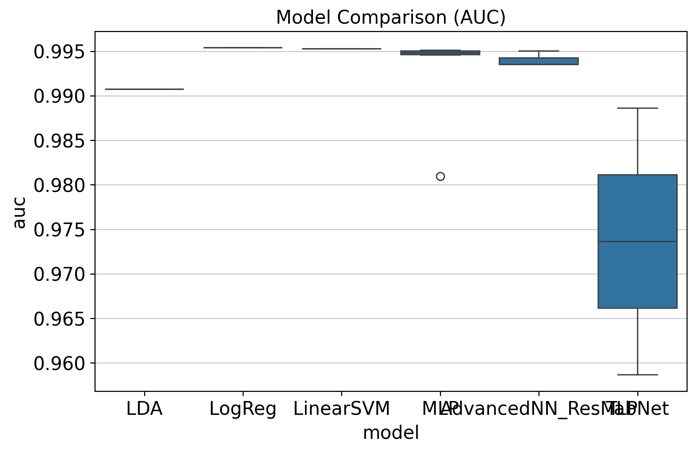

This plot shows that:

- Logistic Regression and Linear SVM achieve extremely high AUC
- MLP and Advanced NN perform similarly
- TabNet has slightly wider variance
- LDA is slightly lower but still strong

Main insight:

classical linear models perform nearly as well as deep learning models  
This suggests that the disease signal is strongly represented in the selected gene features.

---

### Figure 9 — Model Comparison (AUC, Alternative View)
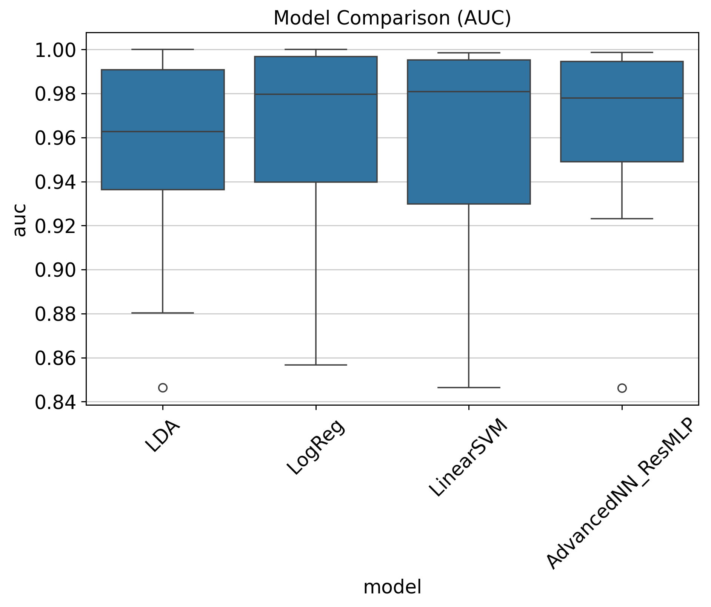

This second comparison plot confirms the same trend:

- all models have high median AUC
- deep learning does not dramatically outperform linear baselines
- variability is larger for complex models

---

## 10.2 Performance by Cell Type

To understand which immune cell groups contribute the most to disease prediction, we computed mean AUC across major cell types.

### Figure 10 — Mean AUC per Cell Type & Model
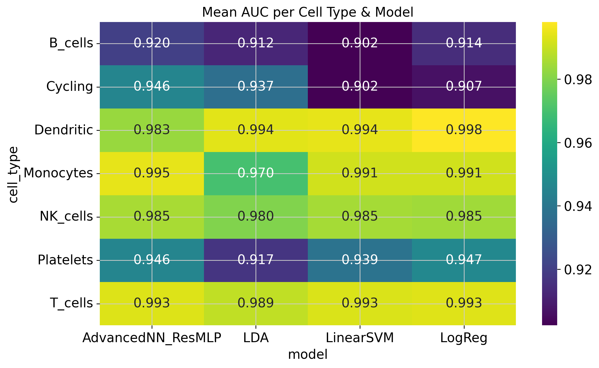

Key findings:

- **Monocytes** show the strongest signal (~0.99+)
- **T cells** and **NK cells** are also highly predictive
- **Dendritic cells** perform strongly
- **B cells** and **Cycling cells** show weaker predictive signal

This suggests that the immune response signature in COVID-19 is most prominent in:

myeloid compartments (Monocytes / Dendritic)  
and cytotoxic compartments (T / NK)

---

## 10.3 Performance by Severity Group

We also evaluated performance across severity subgroups.

### Figure 11 — Mean AUC per Severity & Model
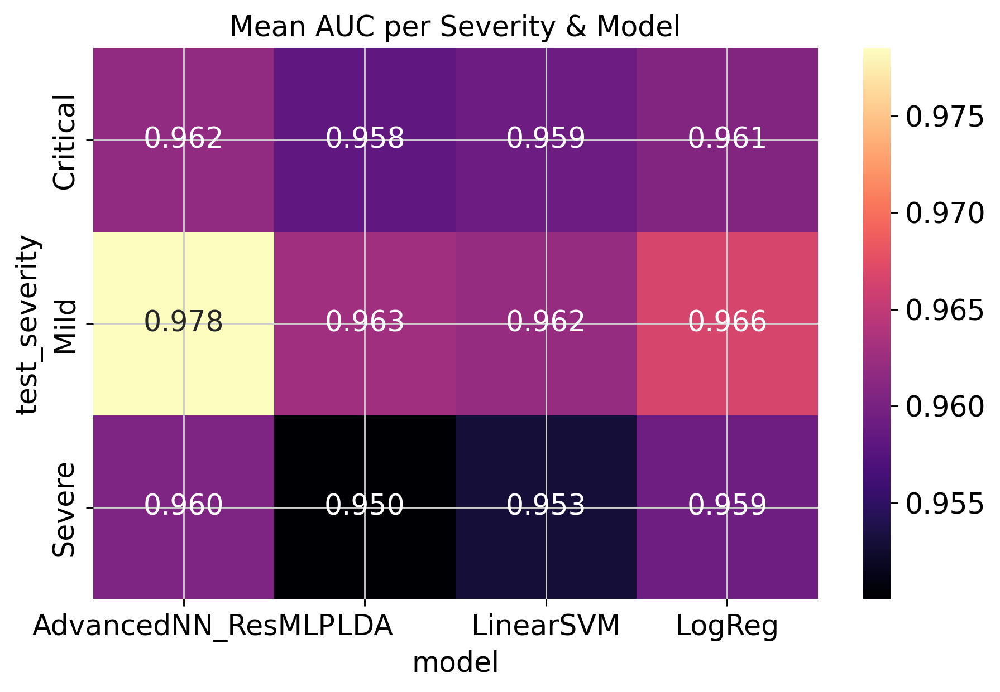

Results show:

- Mild samples are often easiest to separate
- Critical samples remain strongly separable
- Severe cases show slightly lower AUC

This may reflect biological heterogeneity in severe disease, where immune states can vary more widely.

---

Across multiple modeling approaches, the results are consistent:

- Disease vs Healthy is highly predictable from gene expression features.
- Neural networks converge quickly and achieve near-perfect AUC.
- Classical linear models perform almost equally well.
- Monocytes and T/NK compartments carry the strongest disease signal.
- Predictive strength varies slightly across severity groups.

---

---

# Final Summary

This project implemented a full single-cell RNA-seq workflow from raw quality control to clustering, marker-based annotation, and multiple machine learning models for predicting **Disease vs Healthy**.  
The pipeline was structured into 10 phases, each contributing a key component of the final analysis.

---

## Results Summary Table

| Phase | Goal | Main Outputs | Key Takeaway |
|------:|------|--------------|--------------|
| 1 | Data loading & preparation | AnnData object, metadata, initial structure | Dataset is well-formed with disease + severity labels |
| 2 | Quality control (QC) | Violin plots for genes/counts/mito | QC metrics show strong variability and clear outliers |
| 3 | Filtering + normalization | Filtered cells, normalized expression | Removes noisy cells and improves downstream stability |
| 4 | PCA + dimensionality reduction | Variance ratio + PCA projections | Strong structure exists but not fully separated by severity |
| 5 | Neighborhood graph + Leiden tuning | UMAP at multiple resolutions | Resolution affects granularity; stable biological clusters emerge |
| 6 | Final clustering + composition | Final UMAP + cluster fractions | Clusters contain distinct immune populations; disease enrichment differs |
| 7 | Feature engineering for ML | Aggregated gene features per sample | Transforms scRNA-seq into supervised ML-ready format |
| 8 | Neural models (MLP + Advanced NN) | Training curves + ROC | Deep learning performs extremely well (near-perfect AUC) |
| 9 | TabNet training | Training history + ROC | TabNet also achieves strong performance but higher variance |
| 10 | Model comparison + stratified analysis | Boxplots + heatmaps | Linear models perform almost as well; Monocytes & T/NK dominate signal |

---

## Key Biological Findings

Across clustering and marker-based interpretation, the immune landscape reveals meaningful differences between **Healthy** and **COVID-19 Disease**:

### 1) Strong immune cell-type structure
Clustering identifies multiple distinct immune compartments, including:

- T cells (CD4/CD8)
- NK cells
- Monocytes (classical + inflammatory)
- Dendritic cells
- B cells / Plasma-like signatures
- Platelets
- Cycling cells

These populations form well-separated regions in UMAP space, confirming strong biological signal.

---

### 2) Disease signal is strongest in Monocytes and cytotoxic compartments
Model stratification shows the strongest predictive performance for:

- **Monocytes**
- **T cells**
- **NK cells**
- **Dendritic cells**

This suggests that COVID-19 alters immune gene expression most strongly in:

- innate myeloid response
- cytotoxic immune response

---

### 3) Severity is more heterogeneous than disease vs healthy
While disease vs healthy is highly separable, severity classes overlap more:

- Critical and severe states share partially overlapping immune patterns
- Severe samples show higher variability

This aligns with the idea that severe disease can arise from multiple immune trajectories.

---

### 4) Predictive features are highly informative
All models achieved very high AUC, indicating that the selected gene expression signatures contain strong discriminative information for infection status.

---

## Limitations

Although the results are strong, several limitations should be considered:

### 1) Potential donor / batch effects
If the dataset contains donor-specific effects, models may learn:

- patient identity signatures
- technical batch patterns

rather than true disease biology.

---

### 2) Aggregation for ML loses single-cell resolution
Phase 7 required converting scRNA-seq into tabular ML features.  
This aggregation can hide:

- rare cell states
- within-cluster heterogeneity
- subtle severity progression

---

### 3) Possible class imbalance
Some severity groups may contain fewer samples, which can lead to:

- inflated AUC in dominant classes
- less reliable performance in minority groups

---

### 4) Risk of overfitting due to strong signal
Near-perfect AUC suggests strong separation, but also raises the possibility that:

- the dataset may be “too easy”
- leakage could exist (e.g., sample-level bias)

---

## Future Work

Several improvements could strengthen this study and extend its biological impact:

### 1) Perform batch correction
Apply methods such as:

- Harmony
- Scanorama
- scVI

to reduce donor/batch effects before clustering and ML.

---

### 2) Differential expression analysis per cluster
Perform DE testing between:

- Disease vs Healthy within each cluster
- Severity comparisons within key immune types

This will identify mechanistic pathways and marker genes.

---

### 3) Trajectory inference for severity progression
Use tools such as:

- PAGA
- Slingshot
- Monocle

to model immune progression across severity.

---

### 4) Interpretability and biomarker extraction
Extract interpretable gene signatures from:

- Logistic Regression coefficients
- TabNet feature masks
- SHAP values for NN models

to identify robust biomarkers.

---

### 5) External validation
Test the models on an independent scRNA-seq COVID dataset to confirm generalization.

---

# Final Conclusion

This project successfully demonstrates that:

- scRNA-seq immune profiles contain strong disease signatures.
- clustering reveals biologically meaningful immune populations.
- supervised ML models can classify disease state with extremely high accuracy.
- Monocytes and cytotoxic immune cells carry the strongest predictive signal.
- severity prediction is harder due to biological heterogeneity.

---

